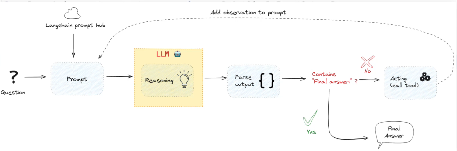

# Agent
You can think about an agent like a bot. It will perform actions in your behalf and it is able to interact with the LLM's.

## What an agent actually does
Agents are more powerful than just simply making API calls or talking to external services. What an **agent** actualy does is it uses LLM to perform those tasks.

The engine of the agent is a LLM

Once we give the task to agent the first thing it does it calculates what subtasks you need to perform in order to achieve and to complete the big task that we sent it.

The agent has ability to make the external calls to a database or to search something online. It has the ability to perform those subtasks. **which is something we called ReAct**  reacting and acting and this is also prompt engineering technique.

### LangChain Tool
These are interfaces that helps our langChain Agents, chains or LLM's use and interact with the external world

Eg: Search online , search in a database and you can think about a tool as an object that has the following information

1. It has a function to execute a python function a callable
2. It has a description what this function has to do our LLM will use this description.

### Different Types of agents in LangChain

### Total Flow

